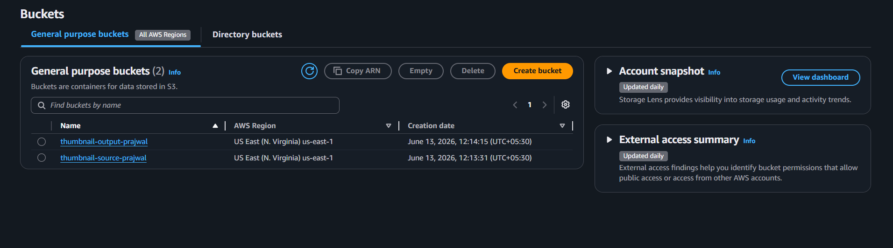
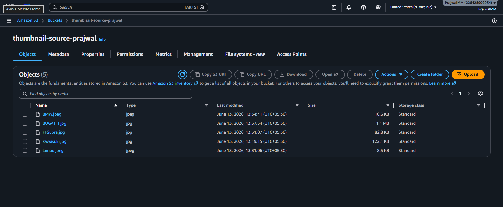
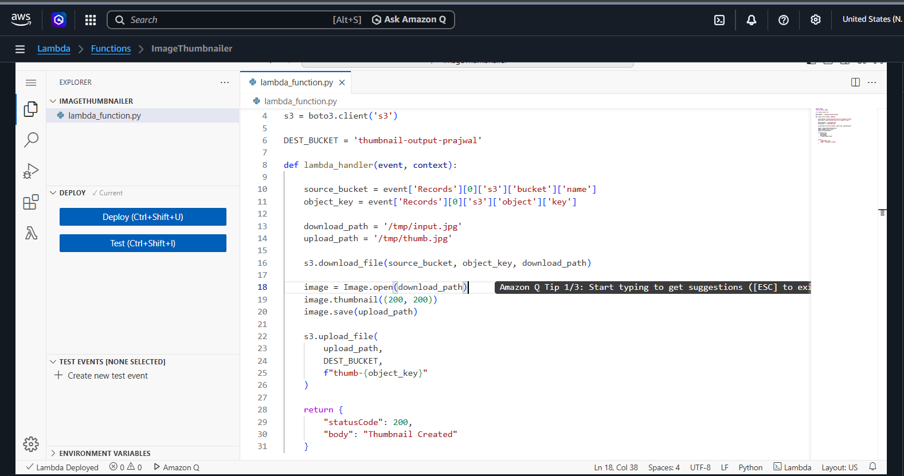
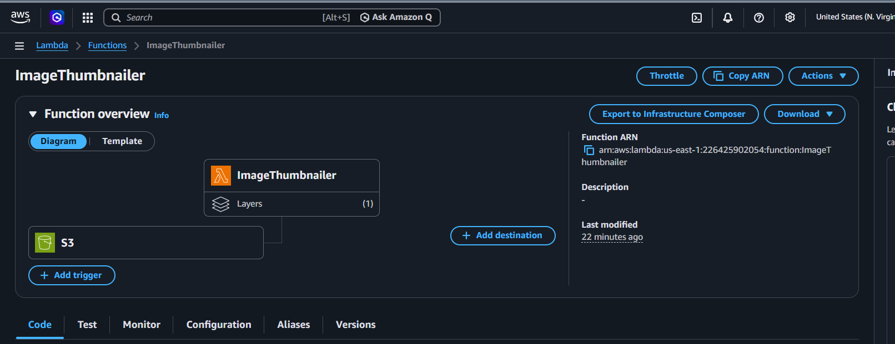
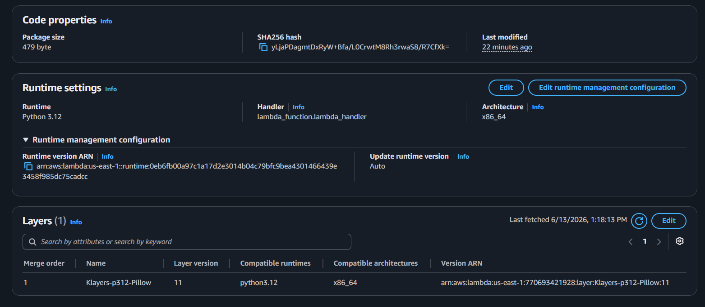
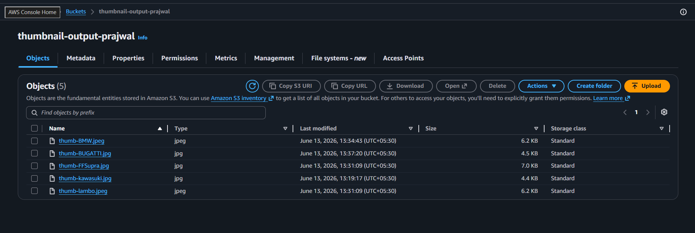
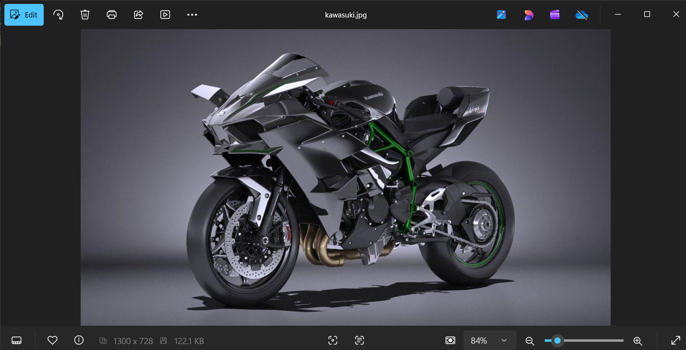
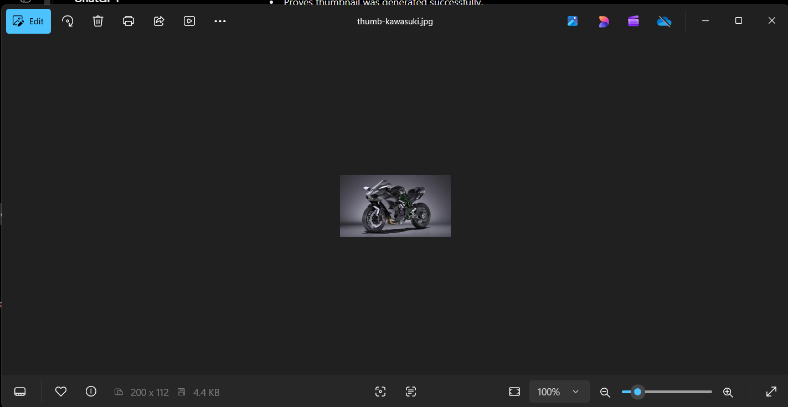

# AWS Lambda Image Thumbnail Generator

## Project Overview

This project automatically generates image thumbnails whenever an image is uploaded to an Amazon S3 bucket.

The solution uses AWS Lambda, Amazon S3, IAM, CloudWatch, and Pillow (Lambda Layer).

---

## AWS Services Used

- Amazon S3
- AWS Lambda
- IAM
- CloudWatch
- Lambda Layers (Pillow)

---

## Workflow

1. Upload image to Source S3 Bucket.
2. S3 Event triggers Lambda Function.
3. Lambda downloads image.
4. Pillow resizes image to fit within 200x200 pixels.
5. Thumbnail is stored in Output S3 Bucket.

---

## Lambda Function

```python
image.thumbnail((200,200))
```

---

## Screenshots

### Buckets


### Source Bucket


### Lambda Code



### S3 Trigger



### Pillow Layer



### Output Bucket



### Original-Img 



### Thumbnail-Img



---

## Result

Original Image:
- 1300 × 728
- 122.1 KB

Thumbnail Image:
- 200 × 112
- 4.4 KB

The thumbnail maintains the original aspect ratio while significantly reducing file size.

---

## Author

Prajwal